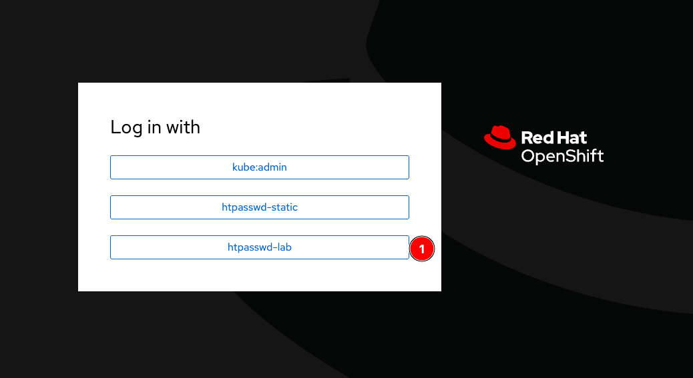
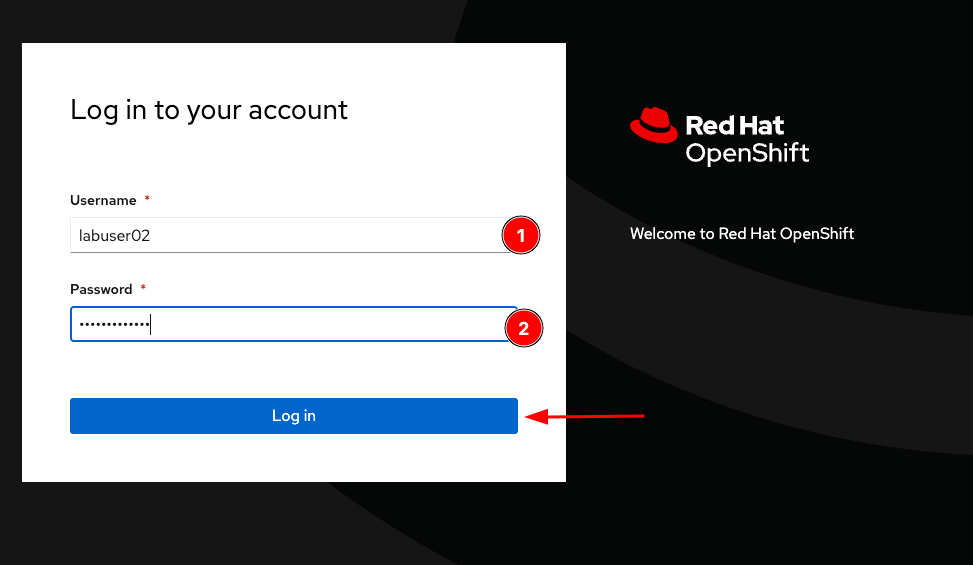
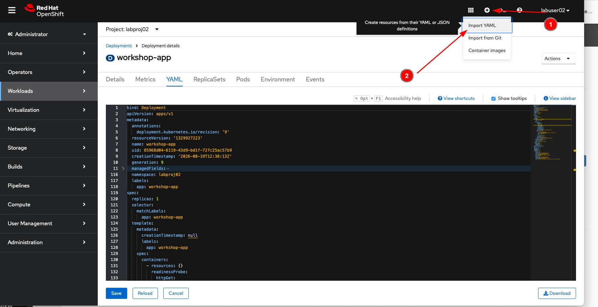
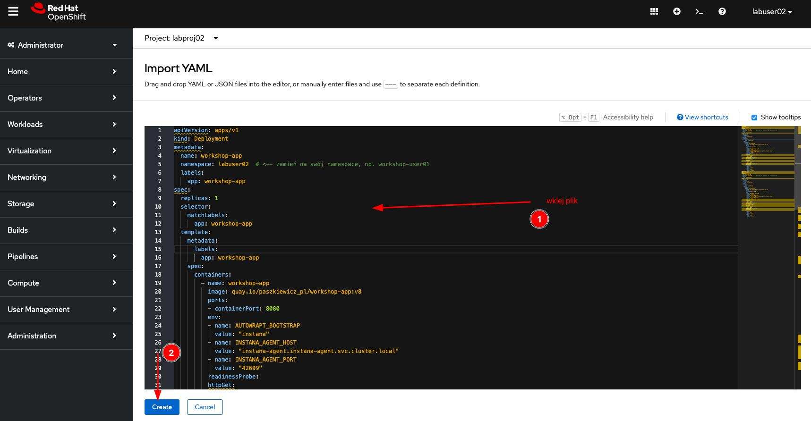
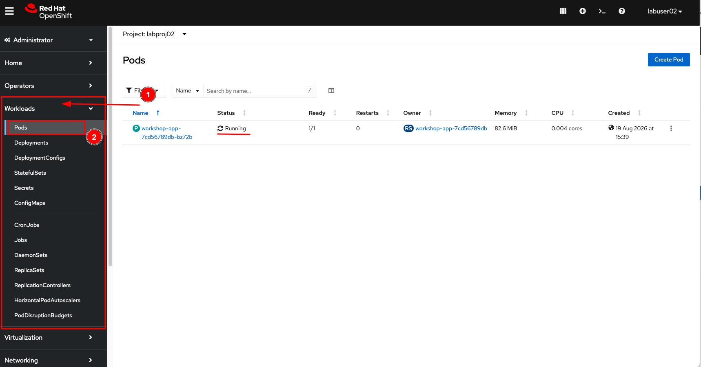
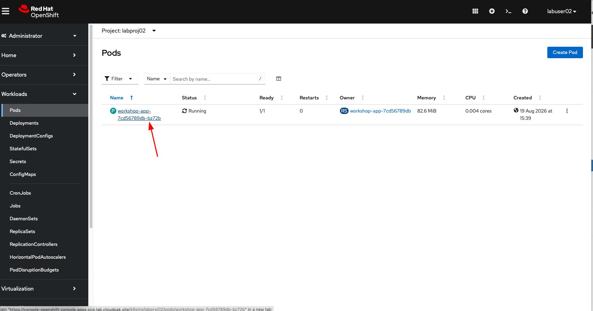
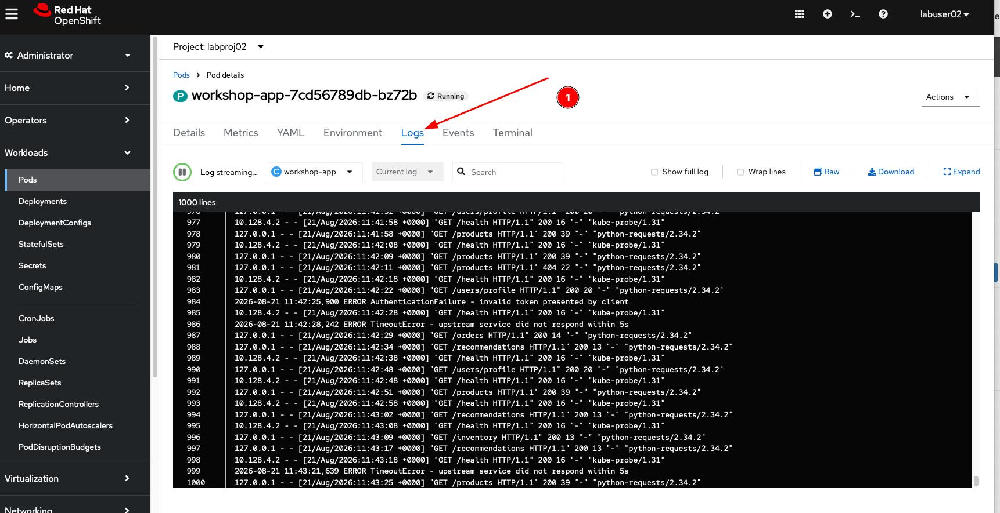

# Lab 1: Deployment aplikacji na OpenShift

## Zawartość

- Lab 1: Deployment aplikacji na OpenShift
    - Założenia
    - Struktura aplikacji
    - Deployment przez graficzne UI OpenShift
    - Weryfikacja działania

---

# Lab 1: Deployment aplikacji na OpenShift

W tym ćwiczeniu wdrożysz aplikację na wspólny klaster OpenShift przez graficzne UI.
Obraz kontenera jest już gotowy i dostępny w rejestrze — Twoim zadaniem jest podmiana
namespace'u w plikach konfiguracyjnych i wdrożenie ich przez interfejs webowy OCP.

Celem ćwiczenia jest:

- zapoznanie się ze strukturą manifestów Kubernetes/OCP,
- deployment aplikacji (`Deployment` + `Service`) przez UI klastra,
- weryfikacja, że aplikacja działa poprawnie.

## Założenia

Zanim zaczniesz, upewnij się, że:

- masz dostęp do konsoli webowej OCP — adres i dane logowania od prowadzącego,
- znasz swój namespace — prowadzący poda Ci go podczas wprowadzenia (format: `labprojNN`),
- masz otwarte repozytorium warsztatowe na swoim komputerze (pobrałeś je z GitHuba).

## Struktura aplikacji

Aplikacja jest napisana we Flasku (Python). Jej kod znajduje się w katalogu `app/src/` —
możesz go przejrzeć, ale nie musisz go modyfikować.

Aplikacja od momentu uruchomienia **samoczynnie generuje ruch i błędy** — w tle działają
wątki, które co kilkanaście sekund wysyłają requesty do własnych endpointów oraz losowo
zwracają błędy HTTP 500. Dzięki temu Instana od razu ma co monitorować.

Endpointy aplikacji:

| Endpoint | Opis |
|---|---|
| `GET /health` | Health check — zwraca `{"status": "ok"}` |
| `GET /products` | Lista produktów |
| `GET /orders` | Lista zamówień |
| `POST /payments` | Płatność — losowo zwraca błąd 500 |
| `POST /checkout/confirm` | Potwierdzenie zamówienia — losowo zwraca błąd 500 |
| …i inne | |

## Deployment przez graficzne UI OpenShift

### Krok 1: Otwórz konsolę webową OCP

Wejdź na adres konsoli podany przez prowadzącego i zaloguj się.
Upewnij się, że masz wybrany swój namespace (`labprojNN`) w dropdownie u góry strony.

### Krok 2: Otwórz plik `app/deployment.yaml`

Otwórz plik `app/deployment.yaml` w edytorze tekstowym lub w Bobie.
Znajdź **dwie** linie zawierające słowo `NAMESPACE` i zamień je na `labproj{NR}`,
gdzie `{NR}` to Twój numer (np. jeśli jesteś `labuser02`, wpisujesz `02`):

```yaml
namespace: labproj{NR}
```

Gotowy plik dla użytkownika `labuser02` wygląda tak:

```yaml
namespace: labproj02
```

Zapisz plik.

### Krok 3: Wdróż Deployment przez UI

Zaloguj się do klastra:


Wpisz swoje dane otrzymane od Prowadzących:


W konsoli OCP kliknij **+** (Import YAML) w prawym górnym rogu.

> 

Wklej zawartość pliku `app/deployment.yaml` i kliknij **Create**, pamiętaj o podmianie NAMESPACE na namespace otrzymany od prowadzącego.


### Krok 4: Wdróż Service przez UI

Powtórz ten sam krok dla pliku `app/service.yaml` — pamiętaj o podmianie `NAMESPACE`.

---

## Niespodzianka: coś jest nie tak z YAML-em

Jeśli po kliknięciu **Create** pojawi się błąd parsowania — nie panikuj.

Przyjrzyj się uważnie plikowi `app/deployment.yaml`. Zwróć uwagę na **wcięcia**.

W formacie YAML wcięcia mają znaczenie — każdy poziom zagłębienia musi być wyrównany
spójnie. Błędne wcięcie powoduje, że klaster odrzuci plik.

Otwórz Boba w trybie **Agent** i poproś go o pomoc:

```
Plik app/deployment.yaml ma błędne wcięcia i nie można go zaaplikować na klaster.
Napraw wcięcia zgodnie ze standardem YAML.
```

Bob znajdzie i poprawi wszystkie błędy wcięć. Skopiuj naprawiony YAML i ponów import w UI.

> **Cel ćwiczenia:** To celowy błąd — pokazuje, że Bob potrafi diagnozować i naprawiać
> problemy z konfiguracją, nie tylko wykonywać komendy.

---

## Weryfikacja działania

Po wdrożeniu przejdź do **Workloads** → **Pods** w swoim namespace'ie.
Powinieneś zobaczyć pod `workshop-app-xxx` w stanie `Running`.

> 

Kliknij na pod → zakładka **Logs** — zobaczysz logi aplikacji z ruchem HTTP i błędami.


---

## Wynik ćwiczenia

Po wykonaniu ćwiczenia w Twoim namespace'ie na klastrze OCP powinny istnieć:

- `Deployment` o nazwie `workshop-app` z jedną repliką w stanie `Running`,
- `Service` o nazwie `workshop-app` wystawiający port `8080`,
- w logach poda widoczny ruch HTTP i błędy generowane automatycznie przez aplikację.

Jesteś gotowy do kolejnego kroku — Instana i monitoring.

➡️ **[Przejdź do Lab 2: Instana — agent i monitoring](02-deploy-instana.md)**
