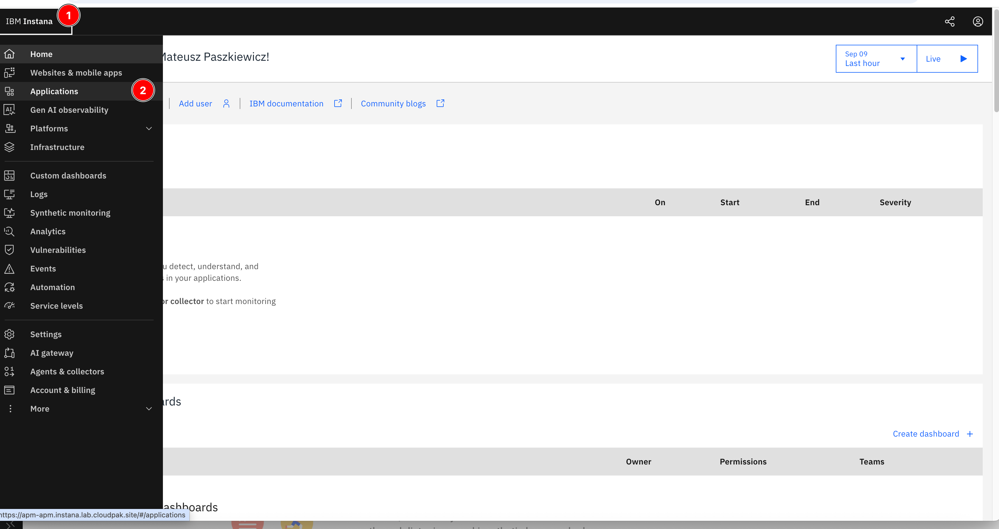
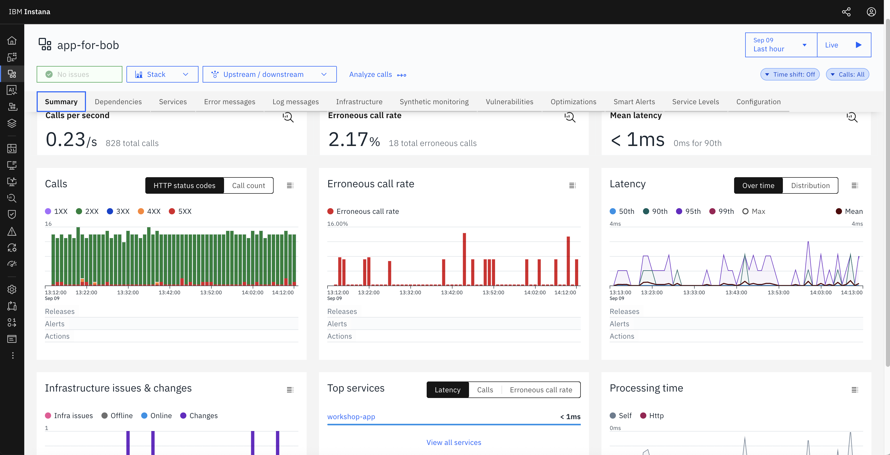
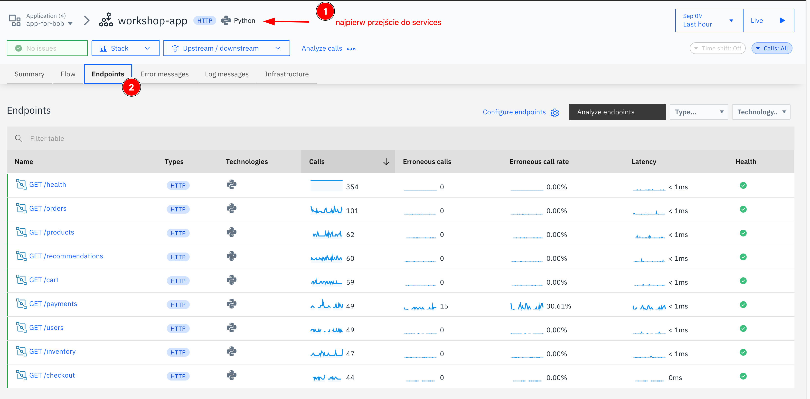
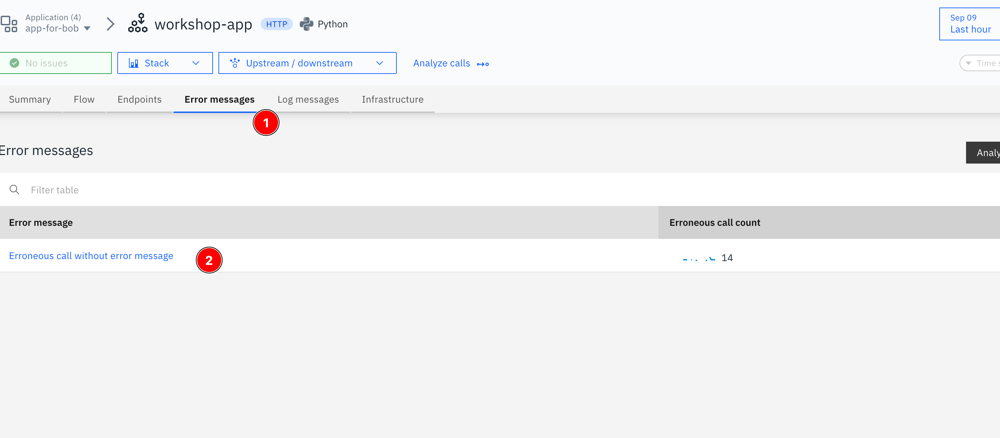

# Lab 2: Instana — agent i monitoring

## Zawartość

- Lab 2: Instana — agent i monitoring
    - Jak działa agent Instana na klastrze
    - Gdybyś instalował agenta samodzielnie
    - Weryfikacja w UI Instany

---

# Lab 2: Instana — agent i monitoring

Na wspólnym klastrze OCP agent Instana jest już zainstalowany przez administratora.
Nie musisz nic wdrażać — od momentu uruchomienia Twojego poda w Lab 1 agent już
zbiera dane o Twojej aplikacji i przesyła je do backendu Instany.

Celem ćwiczenia jest:

- zrozumienie jak działa agent Instana na klastrze Kubernetes/OCP,
- zapoznanie się z tym jak wygląda instalacja agenta,
- weryfikacja, że Twoja aplikacja jest widoczna w UI Instany.

## Jak działa agent Instana na klastrze

Agent Instana to mały program monitorujący, który działa w tle na każdym serwerze klastra.
Możesz go sobie wyobrazić jako czujnik — siedzi cicho obok Twojej aplikacji i bez żadnej
konfiguracji z Twojej strony automatycznie zauważa, że aplikacja działa, ile zasobów zużywa
i czy pojawiają się błędy.

Nasza aplikacja `workshop-app` ma dodatkowo wbudowaną bibliotekę Instany (`instana`),
która sprawia, że Instana widzi nie tylko "aplikacja działa", ale też szczegóły każdego
zapytania HTTP — który endpoint był wywołany, ile czasu zajęło przetworzenie i czy
zakończyło się błędem. To właśnie dzięki temu w Lab 2 zobaczysz w UI Instany listę
endpointów z dokładnymi statystykami.

## Gdybyś instalował agenta samodzielnie

> **Na potrzeby tych warsztatów agent jest już zainstalowany — nie musisz wykonywać poniższych kroków.**

Instalacja agenta Instana na klastrze OCP sprowadza się do kilku komend w terminalu.
Poniżej pokazujemy jak to wygląda przez Helm — najprostszy i najszybszy sposób:

```bash
# 1. Zaloguj się jako admin i utwórz namespace
oc login -u system:admin
oc new-project instana-agent
oc adm policy add-scc-to-user privileged -z instana-agent -n instana-agent

# 2. Zainstaluj agenta przez Helm
helm install instana-agent \
  --repo https://agents.instana.io/helm \
  --namespace instana-agent \
  --set openshift=true \
  --set agent.key=<INSTANA_AGENT_KEY> \
  --set agent.downloadKey=<INSTANA_DOWNLOAD_KEY> \
  --set agent.endpointHost=agent-acceptor.instana.lab.cloudpak.site \
  --set agent.endpointPort=443 \
  --set cluster.name='<NAZWA_KLASTRA>' \
  instana-agent
```

To właściwie tyle — od tego momentu agent działa na każdym węźle klastra i automatycznie
zaczyna zbierać dane ze wszystkich uruchomionych aplikacji. Nie wymaga żadnej konfiguracji
po stronie aplikacji ani zmian w kodzie. W praktyce cały proces od pierwszej komendy
do pojawienia się danych w Instanie zajmuje kilka minut.

## Weryfikacja w UI Instany

Zaloguj się do UI Instany pod adresem podanym przez prowadzącego.

### Krok 1: Znajdź swoją aplikację

Przejdź do **Applications** w lewym menu. Poszukaj aplikacji `app-for-bob`.



### Krok 2: Widok Summary

Kliknij na `app-for-bob` — domyślnie otwiera się zakładka **Summary**.



Na jednym ekranie widzisz wszystko co najważniejsze: liczbę wywołań na sekundę,
procent błędnych requestów (erroneous call rate) i średnią latencję. Wykresy pokazują
jak te wartości zmieniały się w czasie — od razu widać czy coś się zepsuło i kiedy
dokładnie to nastąpiło. Na naszej aplikacji widać ~2% błędów, co odpowiada 
odpowiedziom HTTP 500 generowanym przez endpoint `/payments.

### Krok 3: Sprawdź endpointy i błędy

Kliknij na `app-for-bob` → zakładka **Services** , a później **Endpoints**.

Powinieneś zobaczyć listę endpointów (`/health`, `/products`, `/orders`, `/payments` itd.)
wraz z liczbą wywołań, error rate i latency.



Zakładka **Error messages** pokaże błędy HTTP 500 generowane przez aplikację.




## Wynik ćwiczenia

Po wykonaniu ćwiczenia:

- rozumiesz jak agent Instana działa na klastrze Kubernetes,
- wiesz jak wygląda instalacja agenta w nowym środowisku,
- widzisz swoją aplikację `workshop-app` w UI Instany z endpointami i błędami.

Jesteś gotowy do kolejnego kroku — konfiguracji MCP i monitoringu przez Boba.

➡️ **[Przejdź do Lab 3: Monitoring przez Boba](03-monitoring-with-bob.md)**
