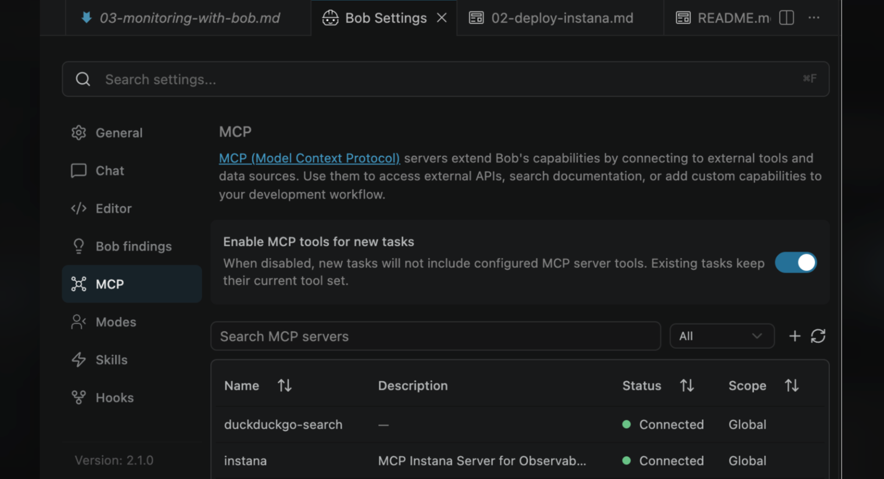

# Lab 3: Monitoring aplikacji przez Boba

## Zawartość

- Lab 3: Monitoring aplikacji przez Boba
    - Założenia
    - Konfiguracja MCP w Bobie
    - Pytanie 1: Czy aplikacja jest zdrowa?
    - Pytanie 2: Jakie błędy wystąpiły w ostatniej godzinie?
    - Pytanie 3: Jakie aplikacje są monitorowane?
    - Pytanie 4: Twoje własne pytanie
    - Interpretacja wyników

---

# Lab 3: Monitoring aplikacji przez Boba

> ⚠️ **Uwaga:** Bob jest narzędziem niedeterministycznym opartym na modelu językowym — może popełniać błędy, generować nieprecyzyjne odpowiedzi lub halucynować nieistniejące dane. Jeśli coś nie działa zgodnie z oczekiwaniami, nie martw się — będziemy naprawiać takie sytuacje wspólnie na warsztatach.

W tym ćwiczeniu skonfigurujesz połączenie Boba z Instaną przez MCP, a następnie zadasz Bobowi
pytania o stan swojej aplikacji — w języku naturalnym — i zobaczysz odpowiedzi zbudowane
na prawdziwych danych z systemu monitoringu.

Nie musisz znać API Instany ani pisać żadnego kodu. Bob przełoży Twoje pytanie na wywołanie
narzędzi MCP i zwróci gotową odpowiedź.

Celem ćwiczenia jest:

- podłączenie Instana MCP do Boba przy jego pomocy,
- zadanie Bobowi pytań o zdrowie aplikacji, błędy i listę monitorowanych aplikacji,
- samodzielne zadanie własnego pytania do Instany przez Boba.

## Założenia

Zanim zaczniesz, upewnij się, że:

- ukończyłeś Lab 1 (aplikacja `workshop-app` działa) i Lab 2 (agent Instana raportuje dane),
- masz token API Instany od prowadzącego (read-only),
- znasz adres swojej instancji Instany (np. `unit-abc.instana.io`).

---

## Konfiguracja MCP w Bobie

### Krok 1: Otwórz czat z Bobem i włącz tryb Agent

Otwórz nowy czat z Bobem. Upewnij się, że w selektorze trybów wybrany jest tryb **Agent** —
tylko w tym trybie Bob może wykonywać komendy i wywoływać narzędzia MCP.

### Krok 2: Zapytaj Boba jak połączyć się z Instaną przez MCP

Najpierw zapytaj Boba o instrukcję:

```
Jak mogę połączyć Cię z Instaną przez MCP (lokalny serwer MCP)?
```

Bob opisze dokładnie co jest potrzebne i jak przebiega konfiguracja. Po przeczytaniu opisu, podaj Bobowi swoje dane i poproś go o skonfigurowanie połączenia (podstaw zmienne):

```
Skonfiguruj połączenie z Instaną przez MCP (lookalny serwer MCP). Mój URL instancji to: https://TWOJ_URL, a token API to: TWOJ_TOKEN
```

Bob samodzielnie skonfiguruje plik MCP i załaduje serwer. W razie pytań poda je w trakcie konfiguracji.

> 💡 **Uwaga:** W trakcie konfiguracji Bob będzie prosił o pozwolenie na wykonanie poszczególnych operacji (np. zapis pliku, uruchomienie komendy). Akceptuj każde z nich, aby proces przebiegł pomyślnie.

### Krok 3: Zweryfikuj połączenie

Po zakończeniu konfiguracji zweryfikuj połączenie w panelu MCP:

1. Kliknij ikonę **zębatki (⚙️)** w prawym górnym rogu panelu Boba.
2. Rozwiń listę serwerów — powinien pojawić się serwer **Instana MCP Server**.
3. Sprawdź czy obok nazwy serwera świeci się **zielona kropka** — oznacza to aktywne połączenie.

Jeśli kropka jest czerwona, sprawdź poprawność tokenu i adresu URL instancji i poproś Boba o ponowną konfigurację.



---

## Pytanie 1: Czy aplikacja jest zdrowa?


```
Używając narzędzi MCP serwera Instana, sprawdź czy aplikacja workshop-app
w namespace labproj02 jest teraz zdrowa. Sprawdź czy pod działa,
czy serwis odpowiada i czy nie ma aktywnych alertów. Odpowiedz po polsku
jednym zdaniem podsumowania i listą kluczowych faktów.
```

Bob wywoła narzędzia MCP Instany (np. `get_services`, `get_events`) i zwróci odpowiedź podobną do:

```
Aplikacja workshop-app jest zdrowa.

• Pod: Running (1/1 ready)
• Serwis: odpowiada na porcie 8080
• Aktywne alerty: brak
• Ostatnie zdarzenie: brak w ciągu ostatnich 30 minut
```

---

## Pytanie 2: Jakie błędy wystąpiły w ostatniej godzinie?


```
Używając narzędzi MCP serwera Instana, pobierz wszystkie błędy i zdarzenia
krytyczne z ostatniej godziny dla aplikacji workshop-app w namespace labproj02.
Podsumuj po polsku: ile błędów wystąpiło, jakiego były typu i kiedy ostatni raz.
```

Bob przeszuka zdarzenia Instany i zwróci raport, np.:

```
W ciągu ostatniej godziny wystąpiły 3 zdarzenia dla aplikacji workshop-app.

• 2x WARNING — high memory usage (ostatni: 14:23)
• 1x ERROR — connection timeout do downstream service (14:41)

Brak zdarzeń krytycznych (CRITICAL).
```

Jeśli aplikacja działa bez problemów, Bob poinformuje, że nie znalazł żadnych błędów.

---

## Pytanie 3: Jakie aplikacje są monitorowane?

Wyślij do Boba:

```
Używając narzędzi MCP serwera Instana, pobierz listę wszystkich aplikacji
które są teraz monitorowane. Podsumuj po polsku nazwy aplikacji i ich status.
```

Bob odpyta Instanę o wszystkie zarejestrowane aplikacje i zwróci listę podobną do:

```
Instana monitoruje aktualnie 4 aplikacje:

• workshop-app (namespace: workshop-user01) — status: zdrowa
• workshop-app (namespace: workshop-user02) — status: zdrowa
• workshop-app (namespace: workshop-user03) — status: zdrowa
• workshop-app (namespace: workshop-user04) — 1 aktywny alert
```

Możesz zobaczyć aplikacje innych uczestników — każdy ma swoją w osobnym namespace'ie.

---

## Pytanie 4: Twoje własne pytanie

Bob ma dostęp do pełnego API Instany przez MCP. Zadaj mu dowolne pytanie, które Cię interesuje, np.:

- *„Jakie były ostatnie 5 zdarzeń krytycznych w całym klastrze?"*
- *„Ile żądań obsłużyła moja aplikacja w ostatnich 30 minutach?"*
- *„Pokaż mi metryki zużycia pamięci przez workshop-app z ostatniej godziny."*
- *„Czy jakiś pod w moim namespace'ie restartował się dzisiaj?"*

Nie ma złych pytań — to jest właśnie siła połączenia AI z observability.

---

## Interpretacja wyników

| Co widzi Bob | Co to oznacza |
|---|---|
| Pod `Running`, brak alertów | Aplikacja działa poprawnie |
| Pod `Pending` lub `CrashLoopBackOff` | Problem z uruchomieniem — sprawdź logi przez Lab 1 |
| Zdarzenia `WARNING` | Potencjalny problem, wymaga uwagi, ale aplikacja działa |
| Zdarzenia `ERROR` lub `CRITICAL` | Aplikacja ma aktywny problem — eskaluj do prowadzącego |
| Bob mówi, że nie ma danych | Agent Instana może jeszcze zbierać pierwsze dane — poczekaj 2–3 minuty |

---

## Wynik ćwiczenia

Po wykonaniu ćwiczenia:

- Bob jest podłączony do Instany przez MCP,
- Bob odpowiedział na pytanie o zdrowie aplikacji na podstawie danych na żywo,
- Bob zwrócił raport błędów z ostatniej godziny,
- Bob pokazał listę wszystkich monitorowanych aplikacji,
- zadałeś własne pytanie i otrzymałeś odpowiedź z danych Instany.

Gratulacje — ukończyłeś wszystkie trzy laboratoria warsztatowe.
Twoja aplikacja jest wdrożona, monitorowana i odpytywana przez AI w czasie rzeczywistym.
